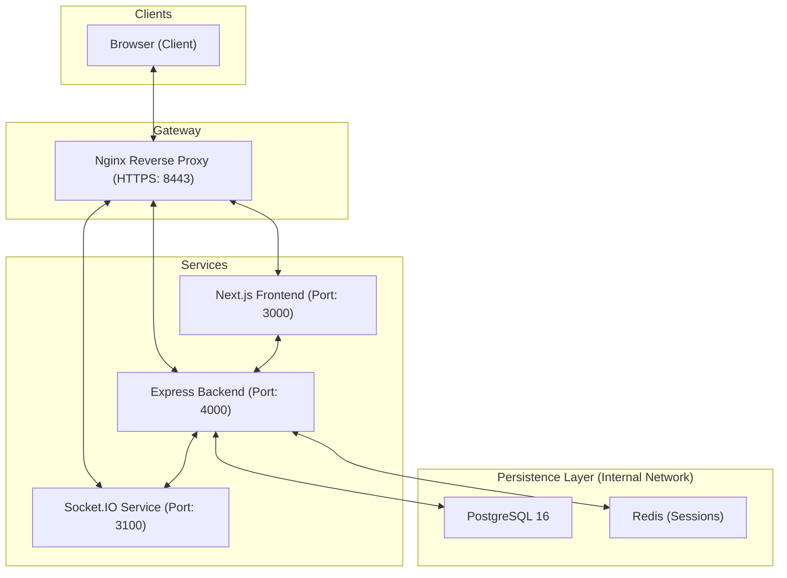
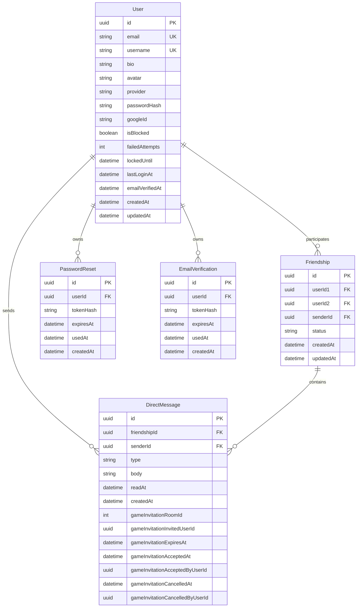

_This project has been created as part of the 42 curriculum by cmanica-, [capapes](https://github.com/carolinapapes), mfontser, joanavar, tatahere._


# Transcendence
### A full-stack web platform combining social interaction, real-time systems, and 
browser-based multiplayer gameplay

---

## Table of Contents

- [Description](#description)
- [Team Information](#team-information)
- [Project Management](#project-management)
- [Technical Stack](#technical-stack)
- [Architecture Overview](#architecture-overview)
- [Database Schema](#database-schema)
- [Getting Started](#getting-started)
- [Features List](#features-list)
- [Modules](#modules)
- [Resources & Documentation](#resources--documentation)
- [AI Usage](#ai-usage)

---

## Description

**Transcendence** is a full-stack web platform developed as part of the 42 curriculum.  
Its goal is to combine a modern web application architecture with authentication, user management, social features, real-time communication, and an in-browser multiplayer game  within a single application.

Beyond the gameplay itself, the project focuses on building a complete and structured web product. The application follows a modular multi-service architecture with separated frontend, backend, socket, database, and reverse-proxy services. This structure enables a typed backend API, real-time interactions through WebSockets, and a technical foundation designed to support both interactive and social experiences.

### Key Features

- **Authentication & Security**: Session-based system with local login and Google OAuth, email verification, and password recovery/reset flows.
- **Social System & Profiles**: Public and private profile pages, social panel with friend search, a friends list, and full friend request management (sent and received requests).
- **Real-Time Communication**: Live presence status (online/offline) and bidirectional updates through WebSockets.
- **Multiplayer Game**: An in-browser 3D strategic turn-based game with real-time match interactions, character classes, grid-board movement, and phase progression.
- **Architecture & API Design**: Shared API contracts between frontend and backend ensuring consistency and type safety.
- **Internationalization**: Fully localized interface in English, Spanish, and Catalan.
- **Frontend System**: Component-based UI architecture documented and organized with Storybook.

---

## Team Information

### cmanica- | Product Owner
Main responsibility:
- Leadership of the in-browser RPG game development.
- Core gameplay mechanics, movement calculations, character classes, and ability cooldown systems.
- Design and implementation of the real-time match state synchronization.

### capapes | Tech Lead
Main responsibility:
- Project architecture and definition of technical standards and best practices.
- DevOps, Docker orchestration, environment setup, and Nginx reverse proxy configuration.
- UI/UX conceptual design, foundational frontend structure, reusable layout patterns, and core visual interfaces.
- Core ownership of authentication flows, security setup, public API work, global state management, and account management.
- Built the social/profile foundation, including private profiles, social state management, friendship workflows, presence integration, and direct messaging.
- Cross-cutting technical support and shared work on internationalization (i18n).
- Writing and organizing the project's internal technical documentation.

### mfontser | Project Manager
Main responsibility:
- Tracking project requirements, module completion, and missing features through team meetings and feature status reviews.
- UI/UX development across the web application, including theme management, static pages, and co-implementation of internationalization (i18n).
- End-to-end feature planning of the Social ecosystem (Dashboard, profiles, user interactions).
- Added public profile support by reusing and extending the existing social/profile foundation, including username-based public access and public user fetching.
- Added public-profile-specific social actions such as unfriend functionality.
- Writing, structuring, and maintaining the main README file.

### joanavar | Developer (Backend)
Main responsibility:
- Backend implementation of social and friendship-related API endpoints and database schemas.
- Real-time presence backend integration and multi-device connection tracking through WebSockets.
- Development of frontend and testing infrastructure for the cross-browser compatibility layer.

### tatahere | Developer
Main responsibility:
- Connection between the game and the web platform.
- Networking, environment setup support, and integration fixes.
- Cross-service integration support across the web, game, and runtime environment.
- Support on infrastructure, runtime configuration, and security-hardening fixes.

---

## Project Management

The team's work was organized  mainly **by features and GitHub issues**, allowing us to track the development of specific parts of the project efficiently.

### Workflow& Organization
- **Issue-based Development**: Work was divided into specific functionalities. Large features were broken down into smaller, manageable GitHub issues. Each issue was then developed in its own dedicated branch (rather than having one massive branch per feature).
- **Integration Control**: We used Pull Requests (PRs) to manage all our code contributions. Every change required an internal review by another team member before being merged into the `main` branch. This flow was crucial to eview architectural decisions before integration, which helped us catch issues early and reduce merge conflicts.
- **Flexible Synchronization**: Instead of rigid cadences or fixed weekly sprints, team meetings and work distribution were continuously adjusted based on current blockers, priorities, and cross-service dependencies.


### Tools used

- **GitHub Projects & Issues**: For general planning, task breakdown, and progress tracking.
- **Notion**: For project documentation and compiling external resources.
- **Figma**: For visual support, UI prototyping, and design references.
- **Discord**: As the main communication channel for the team and internal organization

---
## Technical Stack
The platform is built on a unified **TypeScript** stack, sharing type definitions and **Zod** validation schemas across all services (frontend, backend, and sockets) via a shared contract workspace to ensure end-to-end type safety, robust form verification, and API validation.

### Frontend & BFF (Backend for Frontend)

- **Framework**: **Next.js 16 + React 19 (App Router)**. Chosen for Server-Side Rendering (SSR) capabilities and modern routing. Beyond rendering the UI, it acts as a **Backend for Frontend (BFF)**, handling localized routes, server-side page rendering/hydration, and routing client-side requests securely.
- **Language**: **TypeScript**. Ensures strict typing, component safety, and contract consistency with other services.
- **Styling**: **Tailwind CSS**. Enables rapid iteration while maintaining design consistency across the app.
- **UI & Accessibility**: **React Aria Components**. Helps build robust, accessible, and highly reusable custom components.
- **State Management**: **Zustand**. Selected for its lightweight and efficient approach to global state handling.
- **Internationalization**: **next-intl**. Handles localized routes and dynamic translations.
- **3D Graphics**: **Three.js (@react-three/fiber)**. Powers the immersive, in-browser multiplayer game experience.
- **Documentation & UI Dev**: **Storybook**. Used to visually document, test, and build our custom design system.

### Backend

- **Environment & Framework**: **Node.js + Express**. Selected to maintain a lightweight, decoupled REST API service separate from the frontend.
- **Language**: **TypeScript**. Enforces strict type consistency with the frontend/BFF and socket services.
- **ORM (Database)**: **Prisma**. Maps the relational schema to type-safe database queries.
- **Data Validation**: **Zod**. Enforces shared API contracts on request payloads and responses. The OpenAPI specification is documented in [openapi.yaml](containers/backend/app/docs/openapi.yaml).

### Realtime layer

- **Dedicated Service**: **Socket.IO**. Hosted as a completely independent service from the REST API to handle low-latency bidirectional connections (game sync, chat, and presence status) without blocking the stateless HTTP backend.

### Database & Persistence

- **Relational Database**: **PostgreSQL 16**. Chosen for structured relational persistence (users, friendships, tokens).
- **Session & Cache Layer**: **Redis**. Used for stateful session storage. The system generates a random Session ID (SID) stored in Redis, sent to the browser in a secure `HttpOnly` cookie (`connect.sid`). This stateful approach was chosen over stateless JWTs to support immediate session revocation and seamless Socket.IO handshake authentication.

### Infrastructure

- **Containerization**: **Docker & Docker Compose**. Ensures environments are identical across development and production, encapsulating all independent services.
- **Reverse Proxy**: **Nginx**. Acts as the main entry point, handling incoming traffic routing and local HTTPS termination.
- **Environment Automation**: Custom setup scripts manage the generation of service-specific `.env` files and local SSL certificates, streamlining the development workflow.


---

## Architecture Overview
The application is composed of several independent services coordinated through a reverse proxy. The architecture is designed to build a complete, scalable web platform, where the game is seamlessly integrated into the broader ecosystem.

### High-level flow


### Code Organization & Architecture Principles
Beyond the choice of frameworks, the codebase follows strict architectural patterns to ensure decoupling, type safety, and contract stability:

- **Next.js as a Backend for Frontend (BFF)**: The application is decoupled; it is not a monolith. Next.js runs as a dedicated BFF service. It manages SSR (Server-Side Rendering), manages the internationalization state, and coordinates front-end security policies (e.g., cookie-based page hydration). The Express service acts purely as a stateless REST API backend that handles database transactions and business logic.
- **Shared API Contracts & Multi-Service Zod Validation**: Instead of duplicating validations or models, we built a shared `contracts` workspace. This workspace contains TypeScript types and **Zod validation schemas**. 
  These schemas are imported and executed by **all three layers** for validation:
  1. **Frontend / BFF**: Validates user forms client-side and validates API responses during Server-Side Rendering (SSR).
  2. **Express Backend**: Validates request parameters, queries, and body payloads (using middlewares) before processing business logic.
  3. **Socket.IO Server**: Validates incoming WebSocket event payloads in real-time before handling game state ticks or presence changes.
  This shared approach ensures that validation schemas never drift and enforces absolute data contract compliance across all services.
- **Feature-Based Frontend Structure**: The React application is organized by domain features (e.g., social, auth, game) rather than standard routes or a generic components folder, allowing better scalability as features expand.

---

## Database Schema

The database schema is managed through **Prisma** and is structured to support robust user profiles, social friendships, and secure authentication flows.

### Entities & Relationships



### Schema Notes
- **Social Graph**: The `Friendship` table stores both pending requests and accepted relationships, tracking who initiated the request via `senderId`.
- **Direct Messages**: Stores persistent one-to-one messages between friends. The `type` field distinguishes chat messages (`user`) from game room invitations (`game_invitation`), with invitation metadata (`roomId`, `invitedUserId`, `expiresAt`, `acceptedAt`, `cancelledAt`) stored on the same row.
- **Security**: Sensitive tokens (for password resets and email verification) are stored in a hashed format, and emails/usernames are enforced as unique (UK).
- **Authentication**: The `User` model supports both local login (tracking failed attempts and temporary lockouts) and OAuth integration via `googleId`.

---

## Getting Started 

### Prerequisites
To run this project locally, ensure you have installed:
- **Docker** & **Docker Compose**
- **GNU Make**
- A Unix-like shell environment

### Setup & Launch

1. **Clone the repository**:
   ```bash
   git clone https://github.com/42-BCN/Transcendence.git
   cd Transcendence
   ```

2. **Launch the application**:
   *Note: You **do not** need to run `make setup` manually. The Makefile will automatically run the environment configuration and generate the required HTTPS certificates on-the-fly when starting any environment.*

   > **Note**: For detailed information on how environment variables and certificates are managed under the hood, refer to our internal documentation: [Environment Variables Configuration](scripts/env/README.md) and [Local SSL Certificate Setup](scripts/certs/README.md).

   The project supports three deployment environments. For evaluation or live testing, it is highly recommended to run the **Demo** mode first.

   #### A. Demo Mode (Recommended for Evaluation)
   Runs the application compiled for production, but automatically provisions, pushes the schema, and populates the database with **initial seed data** (test users, friendship graphs, etc.) so you can test features immediately.
   ```bash
   make demo
   ```
   *Access the app at: `https://localhost:8443`*

   #### B. Production Mode
   Runs the pure production environment without database seeding.
   ```bash
   make prod
   ```
   *Access the app at: `https://localhost:8443`*

   #### C. Development Mode
   Runs all services with hot-reloading and mounts source directories for live development.
   ```bash
   make dev
   ```
   *Access the app at: `https://localhost:8443`*

---

### Component Development (Storybook)

The custom design system and its components are documented and interactive inside Storybook. You can launch Storybook locally using:
```bash
make storybook
```
*Access the Storybook dev portal at: `http://localhost:6006`*

---

### Cloudflare Tunnels (For Grading & External Access)

To facilitate grading and remote code evaluation without configuring router firewalls or port forwarding, you can expose the local running Nginx gateway over a secure, temporary Cloudflare Quick Tunnel (`*.trycloudflare.com`). No Cloudflare account is required.

1. **Start the tunnel matching your active environment**:
   * Dev: `make tunnel-quick`
   * Demo: `make demo-tunnel-quick`
   * Prod: `make prod-tunnel-quick`
2. **Find the public URL**:
   Inspect the tunnel logs:
   ```bash
   make demo-tunnel-quick-logs
   ```
   Look for the printed line containing `https://[your-random-subdomain].trycloudflare.com`.
3. **Google OAuth Callback Adjustment**:
   Because the tunnel URL changes every time you launch it, if you plan to test Google OAuth login:
   * Copy the printed tunnel URL.
   * Update the authorized redirect URI in your Google Developer Console to: `https://[your-random-subdomain].trycloudflare.com/api/v1/auth/google/callback`.
4. **Shutdown the tunnel**:
   ```bash
   make demo-tunnel-quick-down
   ```

---

### Makefile Cheat Sheet
We use a comprehensive Makefile to manage the Docker lifecycle and database utilities.

**Service Management**
- `make dev-up`: Start existing dev containers
- `make dev-down`: Stop and remove dev containers
- `make dev-clean`: Deep clean of the environment
- `make dev-logs`: View container logs

**Database Utilities**
- `make db-push`: Push Prisma schema to the database (development only)
- `make db-seed`: Populate the database with initial seed data (development only)
- `make db-reset`: Drop, recreate, and seed the database (development only)

**Container Shell Access**
- `make shell-frontend`
- `make shell-api`
- `make shell-socket`
- `make shell-db`

---

## Features List
This section outlines the core functionalities implemented in the platform, detailing the team members responsible and providing a brief overview of each feature's scope.

### 1. Authentication & Security
- **Team Members**: capapes (with cross-functional support)
- **Description**: Serves as the security foundation and user identity layer for the entire platform.
- **Functionality**: Includes secure user registration, local login/logout, server-side session management with Redis, Google OAuth 2.0 integration, email verification flows, password recovery, and protected route management.

### 2. User Profiles
- **Team Members**: capapes, mfontser
- **Description**: Enables users to manage their own profile and view other users' public profiles.
- **Functionality**: Includes the authenticated/private profile foundation, profile editing, avatar customization, account deletion, public profile access, username-based public user fetching, and social actions from profile views.

### 3. Social System
- **Team Members**: capapes, joanavar, mfontser
- **Description**: A central pillar of the web application that organizes user interactions and supports the project's social dimension.
- **Functionality**: User search, online/offline friend tabs, friend requests, live presence, unread counters, direct messaging, and game room invitations with real-time status tracking.

### 4. Real-Time Interactions
- **Team Members**: joanavar, capapes, tatahere
- **Description**: Provides the real-time behavior necessary for social features and gameplay.
- **Functionality**: Dedicated Socket.IO infrastructure handling live presence events, social change synchronization, direct message updates, and live status updates across connected clients.

### 5. Multiplayer Game
- **Team Members**: cmanica-, tatahere
- **Description**: The core gameplay experience, designed to be seamlessly integrated into the broader platform ecosystem rather than an isolated view.
- **Functionality**: An in-browser 3D strategic turn-based game featuring real-time state synchronization, 3D grid-board rendering with character classes (Paladin, Assassin, Mage, Alchemist), cooldown-based abilities, dice rolling mechanics for planning/execution phases, and deep integration with the web application shell.

### 6. Design System & UI
- **Team Members**: capapes, mfontser
- **Description**: Reduces visual inconsistencies, facilitates scalability, and allows the team to develop new screens more coherently.
- **Functionality**: A comprehensive library of reusable components and shared composites, rigorously styled and documented using Storybook.

### 7. Game Room Invitations
- **Team Members**: capapes
- **Description**: Friends can invite each other into game rooms from the social dashboard, with canonical real-time status tracking across chat, social, and room surfaces.
- **Functionality**: Invitations are sent to online friends, delivered via WebSocket, and stored persistently as special direct messages. A canonical invitation-state store drives the DM invitation cards, the social dashboard invitation tab/badge, and the room panel. Invitations can be accepted or declined, joining a room by any method marks matching received invitations as accepted, and leaving a room invalidates pending invitations in real-time.

### 8. Internationalization (i18n)
- **Team Members**: capapes, mfontser
- **Description**: Treated as a core architectural feature rather than a superficial add-on.
- **Functionality**: Full localized navigation and namespaced translations supporting English, Spanish, and Catalan.

---

## Modules

This section outlines the functional modules implemented for this project in accordance with the 42 Transcendence subject requirements.

### Point Summary Table
We claim a total of **22 points** from fully completed modules (8 Major modules and 6 Minor modules):

| Section | Module | Type | Points | Status |
|:---|:---|:---|:---:|:---|
| **Web** | Use a framework for both the frontend and backend (Next.js & Express) | Major | 2 | Completed |
| **Web** | Real-Time WebSockets | Major | 2 | Completed |
| **Web** | User Interaction (DMs, Profile, Friends) | Major | 2 | Completed |
| **Web** | Public API with Secured Key & Rate Limiting | Major | 2 | Completed |
| **Web** | ORM with PostgreSQL (Prisma) | Minor | 1 | Completed |
| **Web** | Server-Side Rendering (SSR) | Minor | 1 | Completed |
| **Web** | Custom Design System (Tailwind & React Aria) | Minor | 1 | Completed |
| **Accessibility/i18n** | Multiple Languages (at least 3 languages) | Minor | 1 | Completed |
| **Accessibility/i18n** | Support for Additional Browsers | Minor | 1 | Completed |
| **User Management** | Standard User Management & Authentication | Major | 2 | Completed |
| **User Management** | OAuth 2.0 Remote Authentication (Google) | Minor | 1 | Completed |
| **Gaming & UX** | Complete Web-Based Game (3D Strategic RPG) | Major | 2 | Completed |
| **Gaming & UX** | Remote Players (WebSocket State Sync) | Major | 2 | Completed |
| **Gaming & UX** | Advanced 3D Graphics (Three.js / R3F) | Major | 2 | Completed |
| **Total Claimed Points** | | | **22 pts** | |


### Detailed Implementation Specs

#### 1. Web Modules

##### [Major] Use a framework for both the frontend and backend (Next.js & Express)
* **Subject Requirement**: Use a frontend framework (React, Vue, etc.) and a backend framework (Express, NestJS, etc.).
* **Justification**: The application implements a decoupled, non-monolithic architecture utilizing Next.js (React 19) as the frontend service/BFF and Express (Node.js) as the backend REST API service.
* **Implementation Details**:
  * **Frontend**: Next.js 16 (App Router, React 19) is deployed as a dedicated service. Beyond serving UI views, it acts as a **Backend for Frontend (BFF)**, managing page routing, dynamic translations (i18n), and pre-rendering server-side pages (SSR).
  * **Backend**: Express 5.2 acts as a decoupled API service that runs in a separate container, managing core business logic, database transactions via Prisma, and session caching.
  * **Proxy & Integration**: Nginx coordinates traffic routing to these individual decoupled services over HTTPS.

##### [Major] Real-Time WebSockets
* **Subject Requirement**: Implement real-time features using WebSockets or similar technology.
* **Justification**: Low-latency, bidirectional real-time communication for gameplay updates, player status notifications, and instant messaging.
* **Implementation Details**: A dedicated socket.io server written in TypeScript handles events under specialized namespaces (`/chat`, `/friends`, `/game`). Sockets are authenticated and securely linked to users via Express session cookies during the connection handshake. Key features include presence heartbeats, message broadcasting, and low-latency game tick syncing.

##### [Major] User Interaction
* **Subject Requirement**: Allow users to interact with other users (Chat, Profiles, Friends).
* **Justification**: Comprehensive social features bridging user profiles, real-time messaging, and friendship operations.
* **Implementation Details**:
 * **Basic Chat**: Real-time Direct Messaging (DMs) with database persistence.
 * **Profiles**: Public user profiles displaying bios, customized avatars, and connection status.
 * **Friends**: A friendship system with actions for adding, accepting, rejecting, and deleting contacts.

##### [Major] Public API with Secured Key & Rate Limiting
* **Subject Requirement**: A public API to interact with the database with a secured API key, rate limiting, documentation, and at least 5 endpoints.
* **Justification**: Secure external access gateway exposing system metrics and user metrics to third-party developers.
* **Implementation Details**: 
  Exposes exactly 6 public endpoints prefixed under **`https://localhost:8443/public-api/`**:
  * `GET /health` (System status)
  * `GET /users` (Paginated list of users)
  * `GET /users/count` (Total number of registered users)
  * `GET /users/search` (Search users by query string)
  * `GET /users/username/:username` (Retrieve user by username)
  * `GET /users/:userId` (Retrieve user by ID)
  
  Secured via custom header keys (`x-api-key`) with timing-safe comparison (`timingSafeEqual`). Implements Redis-backed request rate limiting (120 req/min general API, 30 req/min search). Fully documented using OpenAPI specs in [openapi.yaml](containers/backend/app/docs/openapi.yaml).

##### [Minor] ORM with PostgreSQL (Prisma)
* **Subject Requirement**: Use an ORM for the database.
* **Justification**: Schema-first PostgreSQL database interactions mapping queries to type-safe TypeScript models.
* **Implementation Details**: PostgreSQL 16 is used for persistence, accessed through the Prisma client. Prisma ORM maps the database schema directly to application models (`User`, `Friendship`, `DirectMessage`, `PasswordReset`, and `EmailVerification`) and generates TypeScript types. An automated seed script is included to populate test data.

##### [Minor] Server-Side Rendering (SSR)
* **Subject Requirement**: Server-Side Rendering (SSR) for improved performance and SEO.
* **Justification**: Next.js Server Components are rendered on the server to optimize the first contentful paint (FCP) and reduce the JavaScript bundle size loaded by the client.
* **Implementation Details**: Dynamically fetched user profiles, dashboards, and landing layouts are pre-rendered on the server side using asynchronous React Server Components (RSC), retrieving data via internal API calls prior to client-side layout hydration.

##### [Minor] Custom-made Design System
* **Subject Requirement**: Custom-made design system with reusable components (minimum: 10 components).
* **Justification**: Designing a bespoke components library from scratch using primitive layers to ensure design consistency and responsiveness without relying on pre-styled off-the-shelf UI frameworks.
* **Implementation Details**: Over 20 custom reusable components (including Buttons, Inputs, Dialogs, Accordions, and Tabs) built using Tailwind CSS and React Aria Components. The entire design system is fully documented and interactive inside Storybook for visual validation and component testing.


#### 2. Accessibility & Internationalization

##### [Minor] Support for Multiple Languages (i18n)
* **Subject Requirement**: Support for multiple languages (at least 3 languages).
* **Justification**: Full application localization across three distinct European languages.
* **Implementation Details**: Configured using `next-intl` to support English, Spanish, and Catalan. All dashboard text, alerts, and strategy game HUD elements are translatable and switched dynamically via the UI switcher.

##### [Minor] Support for Additional Browsers
* **Subject Requirement**: Full compatibility with at least 2 additional browsers.
* **Justification**: Consistent rendering, script execution, and visual layouts across multiple web rendering engines.
* **Implementation Details**:
 * **Target Engines**: Both desctop and movile last 2 versions of Google Chrome (Blink), Mozilla Firefox (Gecko), Apple Safari (WebKit), and Microsoft Edge (Chromium).
 * **Visual Fallbacks**: Programmed `@supports` rules for backdrop filters (glassmorphic UI falls back to opaque styling), and cross-browser CSS animation keyframes replacing `tailwindcss-animate`.
 * **Functional Fallbacks**: Integrated native WebGL detection in `ThreejsScene` to prompt user-friendly configuration alerts. Configured Socket.IO to support HTTP long-polling transport fallback in all 4 client socket instances if WebSocket protocol connections fail.
 * **Testing & Auditing**: Playwright + Vitest configured to run automated browser component tests in Firefox and WebKit alongside Chromium (`test:firefox`, `test:webkit`, `test:all-browsers`). Comprehensive compatibility charts and manual testing checklists are detailed in [Browser Compatibility Guidelines](containers/frontend/web/docs/BROWSER_COMPATIBILITY.md).


#### 3. User Management

##### [Major] Standard User Management & Authentication
* **Subject Requirement**: Standard user management and authentication.
* **Justification**: Secure credential registration, session persistence, user profile customization, and real-time connection state management. Rather than stateless JWTs, a **stateful session architecture** backed by Redis was implemented. 
  
  **Why Session Cookies over JWT?**
  1. **Instant Session Revocation**: In real-time apps, when a user is blocked or logs out, access must be revoked instantly. Stateless JWTs remain valid until they expire unless a database-backed blacklist is checked, negating JWT's stateless benefits. With Redis sessions, we simply delete the Session ID (SID), immediately blocking subsequent REST API requests and cutting off active WebSockets.
  2. **WebSocket Handshake Security**: WebSockets do not support custom headers natively during handshake. By using standard secure HTTP cookies (`connect.sid`), the Socket.IO server interceptor validates the cookie against Redis in real-time, instantly establishing security and binding the socket connection to a verified `userId`.
  3. **No Stale User Claims**: Claims stored in JWTs (like username or block status) can become stale. Stateful sessions fetch fresh status directly from PostgreSQL or the cache on request.
  4. **XSS Protection**: The `connect.sid` cookie is flagged `HttpOnly`, `Secure`, and `SameSite=Strict`, making it inaccessible to client-side scripts and protecting users from token-theft via XSS.
* **Implementation Details**: Passwords are secure-hashed using `Argon2`. Session data is managed in Redis (`connect-redis`) and validated through secure, HTTP-only cookies. The implementation includes token-based email verification, password recovery flows, profile editing with customizable user avatars (selected from a predefined asset list), and temporary account lockouts on excessive failed login attempts.

##### [Minor] Remote Authentication with OAuth 2.0
* **Subject Requirement**: Implement remote authentication with OAuth 2.0.
* **Justification**: Allowing users to register and sign in securely through a major third-party identity provider.
* **Implementation Details**: Google OAuth 2.0 login is integrated on the backend using Passport.js (`passport-google-oauth20`). The system automatically provisions new user accounts on-the-fly, mapping Google IDs to standard PostgreSQL records and linking profiles seamlessly.


#### 4. Gaming and User Experience

##### [Major] Complete Web-Based Game (3D Strategic RPG)
* **Subject Requirement**: Implement a complete web-based game where users can play against each other.
* **Justification**: Instead of the standard 2D Pong game, the project implements a custom 3D strategic turn-based tactical combat game playable directly in the browser.
* **Implementation Details**: Up to 4 players engage in combat on a grid board. Players select from 4 distinct character classes (Paladin, Assassin, Mage, Alchemist), each equipped with unique cooldown-based abilities. Turn progression is split into distinct Planning and Execution phases, where players roll dice to determine movement ranges and schedule action chains.

##### [Major] Remote Players (WebSocket State Sync)
* **Subject Requirement**: Enable two players on separate computers to play the same game in real-time.
* **Justification**: Sockets-driven lobby matchmaking and real-time gameplay state synchronization across multiple network clients on separate machines.
* **Implementation Details**: The game supports up to 4 concurrent active players in addition to spectator connections. The socket server (`game.socket.ts`) tracks character placements, movement clones, action history queueing, and coordinates damage output calculations and phase transitions globally across all connected clients.

##### [Major] Advanced 3D Graphics (Three.js / R3F)
* **Subject Requirement**: Implement advanced 3D graphics using a library like Three.js.
* **Justification**: Rendering a fully interactive 3D gameplay arena in real-time with responsive visual feedback and controls.
* **Implementation Details**: Built using React Three Fiber (`@react-three/fiber`) and Drei (`@react-three/drei`) wrappers for Three.js. The rendering engine implements dynamic lighting (ambient and directional), an interactive orthographic camera with MapControls (pan and zoom), and real-time mesh color transitions to visually represent path planning, target highlighting, and ability ranges.


### Additional Project Assets
* **Storybook**: Used as the visual development, documentation, and validation environment for the custom design system. It is configured under the `.storybook` directory in the frontend container and contains interactive stories for all 20+ custom components.

---

## Resources & Documentation

This section provides links to the project's internal technical documentation, design specifications, and external technical references.

### Internal Project Documentation
These internal documents explain architectural decisions, API contracts, security strategies, and serve as complementary documentation for the codebase.

* **Project Setup & Environment**:
 * [Environment Variables Configuration](scripts/env/README.md) — How environment files are loaded and managed.
 * [Local SSL Certificate Setup](scripts/certs/README.md) — Details on local HTTPS/SSL certificate generation.
 * [Frontend Env Variables Details](docs/FE-env-variables.md) — Guide on client-side public and server-side variables.

* **Backend & API Specifications**:
 * [Public Developer API Guide](containers/backend/app/docs/public-api.md) — Reference for using our external API.
 * [OpenAPI Spec (YAML)](containers/backend/app/docs/openapi.yaml) — Standard OpenAPI/Swagger specification of the REST API.
 * [API Contract Design](docs/API-contract-documentation.md) — Unified request/response validation schemas.

* **Authentication & Security Strategies**:
 * [Authentication Strategy](docs/auth.strategy.md) — Session lifecycle, token storage, and handshake validation.
 * [Database Integration for Auth](docs/auth.database.md) — Database models and query safety details.
 * [Authentication Security Guidelines](docs/auth.security.md) — Password hashing, rate limiting, and brute-force protection.
 * [Email Verification Flow](docs/auth.email.md) — Registration, verification tokens, and verification status hooks.

* **Frontend & Architecture Layouts**:
 * [Frontend Component Architecture](docs/FE-components.md) — Rules for primitives, controls, and dynamic features.
 * [Form Validation & UX Rules](docs/FE-forms.md) — Standardized validation feedback and field controls.
 * [Real-Time Chat & Socket Architecture](docs/CHAT-real-time-multiplayer-chat-architecture.md) — Event structure and connection recovery rules.
 * [Browser Compatibility Guidelines](containers/frontend/web/docs/BROWSER_COMPATIBILITY.md) — Cross-browser compatibility tables, fallback styling rules, and Playwright configurations.
 * [Learning & CSS Resources](docs/resources.md) — External references, MDN learning paths, cheatsheets, and interactive CSS layout games used during development.

### External Technical References
The core technologies utilized to build and orchestrate the platform:

* **Web Frameworks & Styles**: [Next.js Documentation](https://nextjs.org/) \| [React Documentation](https://react.dev/) \| [Tailwind CSS Docs](https://tailwindcss.com/) \| [React Aria Components](https://react-spectrum.adobe.com/react-aria/react-aria-components.html)
* **API & Database**: [Prisma ORM Guide](https://www.prisma.io/) \| [PostgreSQL Manual](https://www.postgresql.org/) \| [Zod Schemas Validation](https://zod.dev/)
* **Real-time & Graphics**: [Socket.IO Docs](https://socket.io/) \| [Three.js Manual](https://threejs.org/)
* **Infrastructure**: [Docker Documentation](https://docs.docker.com/) \| [Nginx Documentation](https://nginx.org/en/docs/) \| [MDN Web Docs](https://developer.mozilla.org/)

---

## AI Usage

AI tools were utilized strictly as assistive support, not as an unquestioned source of truth. The team maintained full ownership and control over all architectural decisions, implementations, and code integrations.

* **Tools Used**: GitHub Copilot \| ChatGPT

* **Key Use Cases**:
  * **Debugging**: Resolving complex TypeScript type compilation and type safety issues.
  * **Refactoring**: Suggestions to optimize React component rendering and clean up Socket.IO event controllers.
  * **Development Assistance**: On-the-fly code completion and snippets generation for utility functions.
  * **Documentation**: Writing assistance for project documentation and reviewing localization files for internationalization (i18n).
  * **Learning & Concepts**: Explaining advanced architectural concepts and validating technical comparison choices.

* **Team Policy & Verification**:
  * All AI suggestions were reviewed critically and verified manually before acceptance.
  * System architecture, integration checkpoints, and final implementation choices remained entirely under human control.
  * AI was used to accelerate the iteration and comprehension cycle, never to replace team accountability or the curriculum learning objectives.
